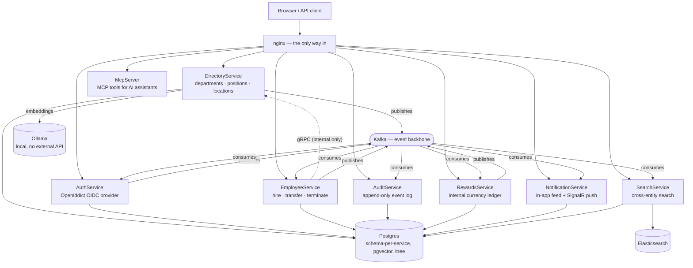

<div align="center">

# dsPortfolio

**A distributed org-management platform, built to work through real distributed-systems
problems end to end — not to be a product.**

[](README.md)
[](README.ru.md)


</div>

---

## What this is

An organization-management platform — departments, positions, locations, employees, an
internal reward currency, real-time notifications, and cross-entity search — split into
eight cooperating .NET services behind one gateway. It's a **portfolio project**: every
piece exists because I wanted to build and defend a specific answer to a real
distributed-systems problem, not because a product needed it. Where that shows: every
non-trivial decision has a written ADR explaining *why*, not just *what* — see
[`docs/adr/`](docs/adr/).

If you're evaluating this as a portfolio, the fastest way in is `docs/adr/` — seven short
records of the actual trade-offs, written the way I'd defend them in a design review, not
backfilled to sound tidy.

## Architecture



Every arrow into Kafka is a **transactional outbox** — the domain write and the "tell the
bus" write commit in the same transaction, so there's no gap between "saved" and "the rest
of the system finds out." Every arrow out of Kafka is an **idempotent, retry-then-dead-letter
consumer** — the same pattern, copied structurally five times (Audit, Notification, Search,
Rewards' welcome-bonus consumer, and the hire→provision saga), not five different mechanisms
to reason about.

## Services

| Service | Role | Protocols |
|---|---|---|
| **DirectoryService** | source of truth for org structure — departments (`ltree` hierarchy), positions, locations — plus pgvector semantic department search | REST + gRPC server, Kafka producer |
| **AuthService** | OpenIddict OIDC provider (`authorization_code` + PKCE, `client_credentials`), ASP.NET Identity, account provisioning | REST + OIDC, Kafka producer + consumer |
| **EmployeeService** | employee records — hire, transfer, terminate — participant in the hire→provision-account saga | REST, gRPC client → DirectoryService, Kafka producer + consumer |
| **AuditService** | append-only record of every event on the bus, with a dead-letter table for what couldn't be processed | Kafka consumer, REST (read-only) |
| **RewardsService** | an internal currency ledger — manual grants and an automatic welcome bonus on hire | REST, Kafka producer + consumer |
| **NotificationService** | a real in-app notification center — persisted feed, unread counts, and a live SignalR push, not a log line | REST + SignalR, Kafka consumer |
| **SearchService** | cross-entity search (employees, departments, positions, locations, audit history) over an Elasticsearch index materialized from the same event stream | REST, Kafka consumer |
| **McpServer** | read-only [MCP](https://modelcontextprotocol.io) tools (semantic search, org tree, employee lookup) for AI assistants | Streamable HTTP, JWT-authenticated |

All REST traffic goes through nginx at `/`; gRPC between EmployeeService and
DirectoryService is internal-only, never exposed to the host.

## Decisions worth reading about

Picked because each one has a real trade-off behind it, not because it was the only option:

- **[Materialize, don't fan out](docs/adr/0007-elasticsearch-cross-service-search.md).**
  Cross-service search could have queried five services live on every keystroke. Instead
  `SearchService` consumes the same Kafka events every other consumer does and builds its
  own Elasticsearch index — the search box never waits on five services being up at once,
  and it can't leak a result from a service whose data it was never allowed to see either
  (it only knows what it was told).
- **[Choreography over orchestration](docs/adr/0003-choreography-saga-for-hire-employee.md)**
  for hiring an employee → provisioning their login account. No new orchestrator process or
  state store — two more Kafka consumers, in the same shape every other consumer in this
  codebase already uses. A failed provisioning attempt is visible on the employee record
  (`ProvisioningFailed`, with a reason), not a silently stuck row.
- **[No API gateway aggregation — until there was evidence for one](docs/adr/0004-no-api-gateway-aggregation.md).**
  Built nginx as a plain reverse proxy on purpose, and said so in writing: *"a decision to
  revisit given evidence, not a permanent stance."* Five services and two rebuilt ones
  later, the evidence showed up (cross-service search), and that ADR is exactly what got
  revisited — not a new plan invented from scratch.
- **[SignalR over polling](docs/adr/0006-signalr-notification-center.md)** for real-time
  notifications, with a deliberate twist: the JWT rides in on the WebSocket URL's query
  string (`?access_token=`), because a browser's WebSocket API can't set an `Authorization`
  header on the upgrade handshake — a documented ASP.NET Core pattern, not a workaround, and
  the ADR says so explicitly rather than leaving it looking like one.
- **[Elasticsearch alongside pgvector — on purpose, not redundantly](docs/adr/0007-elasticsearch-cross-service-search.md).**
  This project already had a semantic search tool for AI assistants (embeddings, cosine
  similarity, meant for a natural-language query). Elasticsearch's `search_as_you_type`
  answers a different question — "what matches these keystrokes, ranked exact → prefix →
  substring" — for a human typing into a search box. Neither replaces the other; the ADR
  explains why they coexist instead of picking one.

## What each service does with concurrency and failure

Deliberately designed for, not discovered as bugs after the fact:

- **Transactional outbox** in every producer — no dual-write gap between "saved" and "the
  rest of the system finds out."
- **Idempotent consumers**, five separate copies of the same shape: dedupe by the message's
  own id (a unique Postgres index, or — for `SearchService` — Elasticsearch's own
  upsert-by-deterministic-id semantics, documented as the one deliberate exception to the
  pattern).
- **Retry, then dead-letter, then stall**: three attempts, then a `dead_letters` row instead
  of a silently dropped message. If even *that* write fails, the consumer stalls on the
  exact offset and keeps retrying rather than skipping a record it never saved.
- **Optimistic concurrency** on `Employee` via Postgres's own `xmin` — two concurrent
  transfers of the same employee produce one success and one `409`, never a silent lost
  update.
- **gRPC resilience**: EmployeeService's calls to DirectoryService carry retry, a circuit
  breaker, and a timeout — a DirectoryService blip doesn't fail every hire outright, and a
  real outage surfaces as `503`, not an opaque `500`.
- **Rate limiting** on `/auth/login`, `/auth/register`, semantic search, and every write
  endpoint — partitioned per client IP, not a shared global bucket.

## Running it

```bash
docker compose up -d
```

Brings up Postgres (`ltree` + `pgvector`), Kafka (KRaft, no Zookeeper), Redis, Elasticsearch,
Ollama (pulls `nomic-embed-text` on first start), Mailpit, an OTel collector, nginx, and all
eight services. Migrations run in dedicated, gated containers before the service that needs
them starts — not inline at every boot, which would fight itself under `restart: always` if
a migration ever failed partway. Health checks gate `docker compose`'s own view of readiness
for every service.

```bash
curl http://localhost/api/departments/roots   # 401 without a token — everything behind nginx requires one
```

`.env.example` documents what's worth overriding locally; copy it to `.env` if you need to.
An optional observability stack (Tempo/Loki/Prometheus/Grafana) is behind a compose profile:

```bash
docker compose --profile obs up -d
```

| Exposed on localhost | What |
|---|---|
| `:80` | nginx — every REST/OIDC endpoint, `/hub/notifications`, and `/mcp` |
| `:5434` | Postgres (`platform` database, one schema per service) |
| `:9200` | Elasticsearch (loopback-only, dev-only security posture) |
| `:9092` | Kafka (loopback-only, for local CLI/GUI inspection) |
| `:11434` | Ollama |
| `:8025` | Mailpit — catches every email AuthService sends locally |

Internal-only (never published to the host): DirectoryService's gRPC port, Redis, and every
service's own HTTP port — nginx is the only way in.

## Tech stack

.NET 10 / ASP.NET Core, EF Core 10 + Npgsql, Dapper for read-heavy catalogue queries,
[CSharpFunctionalExtensions](https://github.com/vkhorikov/CSharpFunctionalExtensions)
(`Result<T, Error>` end to end, no exceptions for expected failure), FluentValidation,
Serilog → OpenTelemetry, OpenIddict, Confluent.Kafka, the official `Elastic.Clients.Elasticsearch`
client, SignalR, HybridCache over Redis, Testcontainers + Respawn for integration tests, k6
for load tests. Frontend: Next.js (App Router) + React + TanStack Query + shadcn/ui.

## Testing

```bash
dotnet test backend/backend.slnx
```

107 tests across architecture-boundary suites (NetArchTest — domain layers can't depend on
infrastructure) and integration suites, each spinning up its own Postgres — and, for
`SearchService`, its own Elasticsearch — via Testcontainers rather than sharing state or
mocking the database. What's covered is deliberately not "everything"; a few things (a live
database going down mid-request, for instance) are exercised by hand against the real stack
instead of automated, and that's noted where it applies rather than left implicit.

CI (`.github/workflows/ci.yml`) builds and runs the full suite on every push and pull
request, plus a separate job that builds every service's Docker image without pushing it, to
catch a broken Dockerfile before `docker compose up` does.

```bash
cd load-tests/k6
docker run --rm --network host -v "$(pwd)":/scripts -w /scripts grafana/k6 run main.js
```

## Project layout

```
backend/
  {Service}/
    {Service}.Domain                    # entities, value objects, invariants — no framework dependencies
    {Service}.Application                 # handlers, validation, Result<T, Error>          (some services)
    {Service}.Infrastructure.{Postgres,*}  # EF Core, Dapper, gRPC clients, Elasticsearch, Kafka
    {Service}.Web                       # controllers, Program.cs, DI wiring
    {Service}.ArchitectureTests         # layer-boundary rules (NetArchTest)
    {Service}.IntegrationTests          # Testcontainers + WebApplicationFactory
  Shared/                               # Envelope, Error, outbox, health checks, CORS — nothing service-specific
docs/adr/                               # architecture decisions, written from why, not backfilled generically
load-tests/k6/                          # load test scenarios
docker/                                 # nginx, Postgres init
frontend/                               # Next.js client (separate concern, own README)
```

## The frontend

Next.js (App Router), with authentication done the way a senior would actually want to
defend it in review, not the fastest way to make a login button work:

- **Auth.js with database-backed sessions**, not a JWT in a cookie — the browser holds only
  an opaque, `HttpOnly` session id. OAuth access/refresh tokens live server-side in a
  dedicated Postgres `web_auth` schema and never reach React state, TanStack Query, or
  `localStorage`.
- **A same-origin BFF proxy** (`app/api/backend/[...path]/route.ts`) is the *only* way the
  browser reaches the backend — it attaches the bearer token server-side, rejects
  cross-origin mutations, and only forwards an explicit allowlist of backend paths, not
  everything nginx exposes.
- Departments, Positions, Locations, People (hire/transfer), and an Activity timeline built
  from `AuditService` are wired up with real create flows, pagination, filtering, and
  accessible loading/empty/error states — not just read-only lists.

## Honest status

Both halves of this project were verified live against the running stack, not just
unit-tested — but they were built and merged from two branches that diverged for several
days, and the newest backend work hasn't caught up to the frontend yet. Said plainly rather
than glossed over:

- **RewardsService, NotificationService, and SearchService have no frontend yet** — not
  because auth is missing (it isn't), but because the BFF's own allowlist
  (`app/api/backend/[...path]/route.ts`) doesn't include `/api/rewards`, `/api/notifications`,
  or `/api/search` yet, and nothing calls them. This is the actual next milestone: three
  working backends with zero UI surface.
- `NotificationService`'s live SignalR push has no frontend client at all yet (no
  `@microsoft/signalr` dependency) — the REST feed would work through the BFF once allowlisted,
  but the real-time push needs its own connection story (the BFF pattern above is HTTP-shaped,
  not WebSocket-shaped, and hasn't been extended to cover it).
- Cross-service search covers five entity kinds; it doesn't yet cover department hierarchy
  path in results, or position/location updates and deletions — both entities only support
  create today, so there's nothing to update or delete yet.
- The observability stack (Tempo/Loki/Prometheus/Grafana) is wired and working but optional
  by design (`--profile obs`) — traces and metrics exist, dashboards are minimal.

I'd rather a portfolio README say "here's what's actually missing and why" than read like
marketing copy for a project nobody's going to production with.
