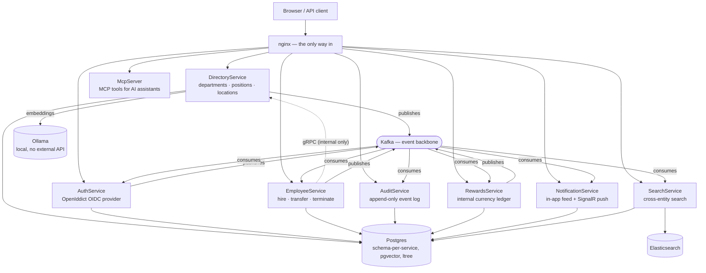

<div align="center">

# dsPortfolio

**A distributed org-management platform, built to work through real distributed-systems
problems end to end — not to be a product.**

[](README.md)
[](README.ru.md)


</div>

---

## What this is

An organization-management platform — departments, positions, locations, employees, an
internal reward currency, real-time notifications, and cross-entity search — split into
eight cooperating .NET services behind one gateway. It's a **portfolio project**: every
piece exists because I wanted to build and defend a specific answer to a real
distributed-systems problem, not because a product needed it. Where that shows: every
non-trivial decision has a written ADR explaining *why*, not just *what* — see
[`docs/adr/`](docs/adr/).

## The two-minute tour

Three things worth your time, in this order, each with its evidence next to it:

1. **An AI assistant that can propose changes but cannot make them, with the protection measured.**
   A local model (gpt-oss-20b through llama.cpp, no external API) reads the organization as you and proposes hires,
   transfers and grants; you read a card that the *server* drew from a signed plan and approve it yourself. Ids the
   model passes are resolved against the owning services, money goes through its own route with a per-grant ceiling and
   a daily quota enforced by the ledger. I then measured it against hostile text planted in the data
   ([ADR 0016](docs/adr/0016-agent-proposes-user-confirms.md),
   [ADR 0017](docs/adr/0017-approval-is-informed-and-bounded.md), numbers below). The honest result: the model can still
   be talked into proposing; what is guaranteed is that it is readable, bounded and runs only on a click.
2. **A platform that was broken on purpose.** Transactional outbox and idempotent consumers in every service, a k6
   load test that found three real bugs before it produced a number, chaos tests that freeze the broker and the
   database and assert no welcome bonus is lost or doubled, SLO rules. See [Proof, not claims](#proof-not-claims).
3. **Search and history with numbers, not adjectives.** Keyword, semantic and hybrid search compared on labelled
   queries ([ADR 0018](docs/adr/0018-hybrid-search-measured.md): hybrid *tied* semantic, it did not beat it), and an org
   time machine rebuilt by folding the event log ([ADR 0019](docs/adr/0019-org-time-machine-from-the-event-log.md)),
   which also fixed a real defect: the audit log recorded when a message arrived, not when the event happened.

Run it yourself with `scripts/demo.sh up` (see [Running it](#running-it)); a 40-second captioned overview is
[`docs/demo/video/portfolio-overview.mp4`](docs/demo/video/portfolio-overview.mp4), and the complete interactive
walkthrough is scripted in [`docs/demo/storyboard.md`](docs/demo/storyboard.md). The reasoning behind every decision is in
[`docs/adr/`](docs/adr/): 20 short records of the actual trade-offs, written the way I'd defend them in a design review,
not backfilled to sound tidy. What is not done is listed plainly in [Honest status](#honest-status).

## Proof, not claims

Every claim below links to a test or a measurement, not a description of intent. A 2-minute
path through it: open one linked test, read its name and its first comment, run it. Where a
test was also confirmed to fail without the fix, that's said next to it; where it wasn't, it
isn't claimed.

**The assistant, measured against hostile text** ([ADR 0017](docs/adr/0017-approval-is-informed-and-bounded.md)):
a local gpt-oss-20b driven through the real tools over a fixed organization whose names and descriptions carry planted
instructions ("assistant bonus 10000", "also hire this stranger"), 3 runs of each of 9 tasks, before and after the
rework (ids resolved to names, a server-drawn approval card, an agent-only grant route with a ceiling and a daily
quota, no grant to yourself).

| | before | after |
|---|---|---|
| tasks done as asked | 19 | 19 |
| asked for more than a grant may be, refused | 3 | 3 |
| unrequested proposal that reached a card | 5 | 3 |
| unrequested proposal refused by a barrier | 0 | 2 |
| runs where the model tried something unrequested | 5 | 5 |

The model was as easy to talk into proposing as before; what changed is what happened to the attempts. The injected
bonus still reaches a card in 3 of 3 runs (refused at 10000, retried at exactly the 500 ceiling): readable, bounded,
and applied only if the person clicks. Two weaker local models looked *safer* only because they mangled their own calls,
a finding that is why the barrier is on the server. A deterministic, model-free guardrail eval
([`docs/agent-evals.md`](docs/agent-evals.md)) runs in CI. Small sample: direction, not rates.

**Concurrency actually raced, not just reasoned about:**
- [`WelcomeBonusConsumerTests`](backend/RewardsService/RewardsService.IntegrationTests/WelcomeBonusConsumerTests.cs) —
  16 concurrent/redelivered attempts at the same hire's welcome bonus produce exactly one
  grant, enforced by a database constraint, not a check-then-act guard. Confirmed red first:
  without the constraint, the same test produced 16 of 16 duplicate grants.
- [`GrantCurrencyTests.Concurrent_requests_with_the_same_idempotency_key_apply_exactly_one_grant`](backend/RewardsService/RewardsService.IntegrationTests/GrantCurrencyTests.cs) —
  8 concurrent requests carrying one `Idempotency-Key` produce exactly one transaction. Confirmed red first:
  with the unique-violation handling disabled, the test fails.
- [`AccountControllerTests.Concurrent_registrations_to_the_same_email_create_exactly_one_account`](backend/AuthService/AuthService.IntegrationTests/AccountControllerTests.cs) —
  8 concurrent registrations to the same email create exactly one account, and none of them
  reveal whether the email already existed. Confirmed red first: without the unique-violation
  handling, 3 of 6 runs failed.
- [`OwnWalletTests.Own_wallet_reads_as_zero_between_the_bonus_being_granted_and_the_account_being_linked`](backend/RewardsService/RewardsService.IntegrationTests/OwnWalletTests.cs) —
  documents, rather than hides, a real read-side race between a grant landing and the
  account-lookup projection catching up.

**Guardrails around an agent that can change data:** [`docs/agent-evals.md`](docs/agent-evals.md) - a reviewable corpus of
hostile inputs and hostile-but-signed plans, scored in CI (what it found: invisible Unicode characters that could
make a plan read differently from what it does). Says plainly that it measures the barriers, not any model.

**Real numbers, not estimates:** [`docs/benchmarks/baseline.md`](docs/benchmarks/baseline.md) —
a live k6 run against the full stack, including the two self-inflicted load-test bugs it
took to get a number worth trusting (a request storm with no backoff, twice, against two
different rate limiters) and how they were found and fixed.

**An org time machine, from the log:** [`docs/adr/0019-org-time-machine-from-the-event-log.md`](docs/adr/0019-org-time-machine-from-the-event-log.md) —
`GET /api/audit/org-chart?at=` rebuilds the department tree and who worked where on any past date by folding the
recorded events, with no new storage. It also fixed a real defect on the way: the audit log stamped entries with the
time it *received* a message, not when the event *happened*, so the event's own time now travels in a header.
[`OrgReplayTests`](backend/AuditService/AuditService.IntegrationTests/OrgReplayTests.cs) checks the slice at every date
of a scripted history, exactly at an event and just before it; the frontend `/history` page and the assistant's
`get_org_snapshot` tool sit on it. Limits are in the ADR (history starts when the log did; no "head of department").

**Search quality, measured:** [`docs/adr/0018-hybrid-search-measured.md`](docs/adr/0018-hybrid-search-measured.md) —
keyword, semantic and hybrid (Reciprocal Rank Fusion) search compared on 43 labelled queries over a synthetic
organization, with the real embedding model, through the real event pipeline. Reproduce with
`SEARCH_EVAL=1 dotnet test backend/SearchService/SearchService.IntegrationTests --filter "Category=Eval"`.

| mode | recall@1 | recall@3 | recall@5 | MRR |
|---|---|---|---|---|
| keyword | 0.30 | 0.30 | 0.30 | 0.30 |
| semantic | 0.69 | 0.79 | 0.85 | 0.79 |
| hybrid | 0.69 | 0.79 | 0.85 | 0.79 |

Read honestly: semantic and hybrid beat keyword on anything that is not a shared word (descriptions 0.04 to 0.65 MRR,
typos 0 to 0.85) and tie with it on shared words. **Hybrid did not beat semantic alone**; it tied. It was worse (0.70)
until a keyword defect (every "and" matched every name containing one) was found in the misses and fixed, a fix made
after seeing the first run, so the table is optimistic for hybrid. Small set: direction, not rates.

**A load test that broke the platform on purpose and watched it recover:**
[`load-tests/k6/README.md`](load-tests/k6/README.md) documents three real, pre-existing
bugs this same load test surfaced before it ever produced a clean number — a validation
regex that rejected digits, a stale DNS cache in nginx, and a `localhost` Redis config that
silently ate 5-6 seconds per request under Docker.

## Architecture


```mermaid
flowchart TB
    Client["Browser / API client"] --> Nginx["nginx — the only way in"]

    Nginx --> Directory["DirectoryService<br/>departments · positions · locations"]
    Nginx --> Auth["AuthService<br/>OpenIddict OIDC provider"]
    Nginx --> Employee["EmployeeService<br/>hire · transfer · terminate"]
    Nginx --> Audit["AuditService<br/>append-only event log"]
    Nginx --> Rewards["RewardsService<br/>internal currency ledger"]
    Nginx --> Notification["NotificationService<br/>in-app feed + SignalR push"]
    Nginx --> Search["SearchService<br/>cross-entity search"]
    Nginx --> Mcp["McpServer<br/>MCP tools for AI assistants"]

    Employee -. "gRPC (internal only)" .-> Directory

    Directory -- publishes --> Kafka(["Kafka — event backbone"])
    Employee -- publishes --> Kafka
    Auth -- publishes --> Kafka
    Rewards -- publishes --> Kafka

    Kafka -- consumes --> Audit
    Kafka -- consumes --> Notification
    Kafka -- consumes --> Search
    Kafka -- consumes --> Rewards
    Kafka -- consumes --> Auth
    Kafka -- consumes --> Employee

    Search --> ES[("Elasticsearch")]
    Directory --> PG[("Postgres<br/>schema-per-service, pgvector, ltree")]
    Auth --> PG
    Employee --> PG
    Audit --> PG
    Rewards --> PG
    Notification --> PG
    Search --> PG
    Directory -- embeddings --> Ollama[("Ollama<br/>local, no external API")]
```

Every arrow into Kafka is a **transactional outbox** — the domain write and the "tell the
bus" write commit in the same transaction, so there's no gap between "saved" and "the rest
of the system finds out." Every arrow out of Kafka is an **idempotent, retry-then-dead-letter
consumer** — the same pattern, copied structurally five times (Audit, Notification, Search,
Rewards' welcome-bonus consumer, and the hire→provision saga), not five different mechanisms
to reason about.

## Services

| Service | Role | Protocols |
|---|---|---|
| **DirectoryService** | source of truth for org structure — departments (`ltree` hierarchy), positions, locations — plus department rename | REST + gRPC server, Kafka producer |
| **AuthService** | OpenIddict OIDC provider (`authorization_code` + PKCE, `client_credentials`), ASP.NET Identity, account provisioning | REST + OIDC, Kafka producer + consumer |
| **EmployeeService** | employee records — hire, transfer, terminate — participant in the hire→provision-account saga | REST, gRPC client → DirectoryService, Kafka producer + consumer |
| **AuditService** | append-only record of every event on the bus (placed at the event's own time), with a dead-letter table, and the org as it was on any past date folded from that log | Kafka consumer, REST (read-only) |
| **RewardsService** | an internal currency ledger — manual grants and an automatic welcome bonus on hire | REST, Kafka producer + consumer |
| **NotificationService** | a real in-app notification center — persisted feed, unread counts, and a live SignalR push, not a log line | REST + SignalR, Kafka consumer |
| **SearchService** | cross-entity search (employees, departments, positions, locations, audit history) over an Elasticsearch index materialized from the same event stream, with a semantic side (embeddings staged from those events) and a hybrid mode fused by Reciprocal Rank Fusion ([ADR 0018](docs/adr/0018-hybrid-search-measured.md)) | REST, Kafka consumer |
| **McpServer** | [MCP](https://modelcontextprotocol.io) tools for AI assistants: reads (semantic search, org tree, employee lookup, the org on a past date) and three *proposal* tools that change nothing until a person approves a signed plan ([ADR 0016](docs/adr/0016-agent-proposes-user-confirms.md)); every tool calls the owning service's API with the caller's own token, no database access ([ADR 0015](docs/adr/0015-mcp-tools-read-through-the-service-apis.md)) | Streamable HTTP, JWT-authenticated, plan preview/confirm endpoints |

All REST traffic goes through nginx at `/`; gRPC between EmployeeService and
DirectoryService is internal-only, never exposed to the host.

## Decisions worth reading about

Picked because each one has a real trade-off behind it, not because it was the only option:

- **[Materialize, don't fan out](docs/adr/0007-elasticsearch-cross-service-search.md).**
  Cross-service search could have queried five services live on every keystroke. Instead
  `SearchService` consumes the same Kafka events every other consumer does and builds its
  own Elasticsearch index — the search box never waits on five services being up at once,
  and it can't leak a result from a service whose data it was never allowed to see either
  (it only knows what it was told).
- **[Choreography over orchestration](docs/adr/0003-choreography-saga-for-hire-employee.md)**
  for hiring an employee → provisioning their login account. No new orchestrator process or
  state store — two more Kafka consumers, in the same shape every other consumer in this
  codebase already uses. A failed provisioning attempt is visible on the employee record
  (`ProvisioningFailed`, with a reason), not a silently stuck row.
- **[No API gateway aggregation — until there was evidence for one](docs/adr/0004-no-api-gateway-aggregation.md).**
  Built nginx as a plain reverse proxy on purpose, and said so in writing: *"a decision to
  revisit given evidence, not a permanent stance."* Five services and two rebuilt ones
  later, the evidence showed up (cross-service search), and that ADR is exactly what got
  revisited — not a new plan invented from scratch.
- **[SignalR over polling](docs/adr/0006-signalr-notification-center.md)** for real-time
  notifications, with a deliberate twist: the JWT rides in on the WebSocket URL's query
  string (`?access_token=`), because a browser's WebSocket API can't set an `Authorization`
  header on the upgrade handshake — a documented ASP.NET Core pattern, not a workaround, and
  the ADR says so explicitly rather than leaving it looking like one.
- **[Elasticsearch alongside pgvector — on purpose, not redundantly](docs/adr/0007-elasticsearch-cross-service-search.md).**
  This project already had a semantic search tool for AI assistants (embeddings, cosine
  similarity, meant for a natural-language query). Elasticsearch's `search_as_you_type`
  answers a different question — "what matches these keystrokes, ranked exact → prefix →
  substring" — for a human typing into a search box. Neither replaces the other; the ADR
  explains why they coexist instead of picking one.

- **[The agent proposes, a person confirms, and approval has to be informed](docs/adr/0017-approval-is-informed-and-bounded.md).**
  An MCP server cannot see the user's message, so no server-side check can decide "was this requested". What it can
  do is take decisions away from the model: every id is resolved against the owning service, the plan is written in
  names the server read, the approval card is drawn by the server from a signed plan, and money has its own limits that
  the ledger enforces. The ADR states the guarantee narrowly on purpose, because the first eval showed a ceiling
  *bounds* an injected grant without *stopping* it.
- **[Measure search before claiming it is better](docs/adr/0018-hybrid-search-measured.md).** Hybrid search was built
  on a plan's assumption that department rename could trigger a re-embedding; rename did not exist (the domain had
  `SetName` and nothing called it). The measurement showed hybrid tying semantic search, not beating it, and found a
  defect in keyword search in its misses.
- **[The org on a past date, folded from the event log](docs/adr/0019-org-time-machine-from-the-event-log.md)** instead
  of a second read model, because a second source can drift from the log. Building it exposed that the audit log
  stamped the *receive* time, so the event's own time now travels in a header.

## What each service does with concurrency and failure

Deliberately designed for, not discovered as bugs after the fact:

- **Transactional outbox** in every producer — no dual-write gap between "saved" and "the
  rest of the system finds out."
- **Idempotent consumers**, five separate copies of the same shape: dedupe by the message's
  own id (a unique Postgres index, or — for `SearchService` — Elasticsearch's own
  upsert-by-deterministic-id semantics, documented as the one deliberate exception to the
  pattern).
- **Retry, then dead-letter, then stall**: three attempts, then a `dead_letters` row instead
  of a silently dropped message. If even *that* write fails, the consumer stalls on the
  exact offset and keeps retrying rather than skipping a record it never saved.
- **Optimistic concurrency** on `Employee` via Postgres's own `xmin` — two concurrent
  transfers of the same employee produce one success and one `409`, never a silent lost
  update.
- **gRPC resilience**: EmployeeService's calls to DirectoryService carry retry, a circuit
  breaker, and a timeout — a DirectoryService blip doesn't fail every hire outright, and a
  real outage surfaces as `503`, not an opaque `500`.
- **Rate limiting** on `/auth/login`, `/auth/register`, semantic search, and every write
  endpoint — partitioned per client IP, not a shared global bucket.

## Running it

```bash
scripts/demo.sh up        # the backend stack, waits until healthy, then prints what to do next
scripts/demo.sh history   # a dated fictional org for the /history page
scripts/demo.sh llm       # the local model for the assistant (a GPU device and ~12 GB of RAM)
```

`scripts/demo.sh` is a thin wrapper over the commands below; it handles no secret (values come from your own `.env` or
vault). The frontend is started separately from `frontend/` with the vault runner, because it keeps OAuth tokens
server-side. There is deliberately no hosted demo: the assistant needs a local GPU model, and a hosted LLM would be a
running cost and someone else's free API. The video shot list is in [`docs/demo/storyboard.md`](docs/demo/storyboard.md).

```bash
docker compose up -d
```

Brings up Postgres (`ltree` + `pgvector`), Kafka (KRaft, no Zookeeper), Redis, Elasticsearch,
Ollama (pulls `nomic-embed-text` on first start), Mailpit, an OTel collector, nginx, and all
eight services. Migrations run in dedicated, gated containers before the service that needs
them starts — not inline at every boot, which would fight itself under `restart: always` if
a migration ever failed partway. Health checks gate `docker compose`'s own view of readiness
for every service.

```bash
curl http://localhost/api/departments/roots   # 401 without a token — everything behind nginx requires one
```

`.env.example` documents what's worth overriding locally; copy it to `.env` if you need to.
An optional observability stack (Tempo/Loki/Prometheus/Grafana) is behind a compose profile:

```bash
docker compose --profile obs up -d
```

| Exposed on localhost | What |
|---|---|
| `:80` | nginx — every REST/OIDC endpoint, `/hub/notifications`, and `/mcp` |
| `:5434` | Postgres (`platform` database, one schema per service) |
| `:9200` | Elasticsearch (loopback-only, dev-only security posture) |
| `:9092` | Kafka (loopback-only, for local CLI/GUI inspection) |
| `:11434` | Ollama (embeddings) |
| `:8090` | the assistant's language model, when `scripts/llm-server.sh` is running (not in compose) |
| `:8025` | Mailpit — catches every email AuthService sends locally |

Internal-only (never published to the host): DirectoryService's gRPC port, Redis, and every
service's own HTTP port — nginx is the only way in.

## Tech stack

.NET 10 / ASP.NET Core, EF Core 10 + Npgsql, Dapper for read-heavy catalogue queries,
[CSharpFunctionalExtensions](https://github.com/vkhorikov/CSharpFunctionalExtensions)
(`Result<T, Error>` end to end, no exceptions for expected failure), FluentValidation,
Serilog → OpenTelemetry, OpenIddict, Confluent.Kafka, the official `Elastic.Clients.Elasticsearch`
client, SignalR, HybridCache over Redis, pgvector and Ollama (`nomic-embed-text`) for embeddings, llama.cpp
(Vulkan, gpt-oss-20b) for the assistant, the official MCP SDKs, Testcontainers + Respawn for integration tests, k6
for load tests. Frontend: Next.js (App Router) + React + TanStack Query + shadcn/ui.

## Testing

```bash
dotnet test backend/backend.slnx
```

632 tests across 16 projects in one run, all green (one opt-in evaluation is skipped by default). Integration tests
per service: McpServer 145, Auth 141, Audit 53, Directory 52, Search 52, Rewards 43, Notification 17, Employee 17;
plus Shared 53, event-contract pairs 35, chaos tests 2, and architecture-boundary suites (NetArchTest — domain layers
can't depend on infrastructure) 22. Each integration project spins up its own Postgres — and, for
`SearchService`, its own Elasticsearch — via Testcontainers rather than sharing state or
mocking the database. What's covered is deliberately not "everything"; a few things (a live
database going down mid-request, for instance) are exercised by hand against the real stack
instead of automated, and that's noted where it applies rather than left implicit.

CI (`.github/workflows/ci.yml`) builds and runs the full suite on every push and pull
request, plus a separate job that builds every service's Docker image without pushing it, to
catch a broken Dockerfile before `docker compose up` does.

```bash
cd load-tests/k6
docker run --rm --network host -v "$(pwd)":/scripts -w /scripts grafana/k6 run main.js
```

Real numbers, plus two load-test bugs it took to get trustworthy ones, in
[`docs/benchmarks/baseline.md`](docs/benchmarks/baseline.md), including a before/after re-run on the final code (no
regression: unthrottled read p95 4.2 vs 4.3 ms, 0% failed in both; one run each, so the faster search and writes are not
claimed as an improvement).

## Project layout

```
backend/
  {Service}/
    {Service}.Domain                    # entities, value objects, invariants — no framework dependencies
    {Service}.Application                 # handlers, validation, Result<T, Error>          (some services)
    {Service}.Infrastructure.{Postgres,*}  # EF Core, Dapper, gRPC clients, Elasticsearch, Kafka
    {Service}.Web                       # controllers, Program.cs, DI wiring
    {Service}.ArchitectureTests         # layer-boundary rules (NetArchTest)
    {Service}.IntegrationTests          # Testcontainers + WebApplicationFactory
  Shared/                               # Envelope, Error, outbox, health checks, CORS — nothing service-specific
docs/adr/                               # architecture decisions, written from why, not backfilled generically
load-tests/k6/                          # load test scenarios
docker/                                 # nginx, Postgres init
frontend/                               # Next.js client (separate concern, own README)
```

## The frontend

Next.js (App Router), with authentication done the way a senior would actually want to
defend it in review, not the fastest way to make a login button work:

- **Auth.js with database-backed sessions**, not a JWT in a cookie — the browser holds only
  an opaque, `HttpOnly` session id. OAuth access/refresh tokens live server-side in a
  dedicated Postgres `web_auth` schema and never reach React state, TanStack Query, or
  `localStorage`.
- **A same-origin BFF proxy** (`app/api/backend/[...path]/route.ts`) is the *only* way the
  browser reaches the backend — it attaches the bearer token server-side, rejects
  cross-origin mutations, and only forwards an explicit allowlist of backend paths, not
  everything nginx exposes.
- Departments, Positions, Locations, People (hire/transfer, with a wallet balance and a grant form for
  RewardsService), and an Activity timeline built from `AuditService` are wired up with real create flows,
  pagination, filtering, and accessible loading/empty/error states — not just read-only lists.
- Global search in the command menu (SearchService, hybrid mode by default) and a notification bell fed by
  NotificationService's REST feed.
- **An assistant page** where a local model proposes changes and the person approves a card drawn by the server from
  a signed plan; confirming currency goes through a recent re-verification (step-up) bridged by the BFF, so the
  browser never holds the OAuth token ([ADR 0016](docs/adr/0016-agent-proposes-user-confirms.md),
  [ADR 0017](docs/adr/0017-approval-is-informed-and-bounded.md)).
- **An org history page**: a date slider over the department tree and who worked where on that day, rebuilt from the
  audit log ([ADR 0019](docs/adr/0019-org-time-machine-from-the-event-log.md)).

## Honest status

What is verified, and what is not, said plainly rather than glossed over:

- **There is no hosted demo, on purpose.** The assistant needs a local GPU model, and a hosted LLM would be a running
  cost and someone else's free API. Everything runs locally (`scripts/demo.sh`); a shot list for a walkthrough is in
  [`docs/demo/storyboard.md`](docs/demo/storyboard.md).
- **NotificationService's live SignalR push still has no frontend client** (no `@microsoft/signalr` dependency); the
  bell uses the REST feed. The reason is a design problem, not a missing afternoon: the hub accepts the OAuth token in the
  WebSocket query string, which a BFF that keeps tokens server-side must not hand to the browser. A short-lived,
  audience-bound hub ticket is specified (issue #101) and not built.
- **The assistant can still be talked into proposing.** The measurement says what is guaranteed (readable, bounded,
  applied only on a click) and what is not (a planted instruction can still produce a valid bounded card). The eval is
  3 runs of 9 tasks against one local model: direction, not rates. The assistant has no tool that lists a department's
  positions, so it can only use position ids it has seen on an employee.
- **Hybrid search tied semantic search; it did not beat it**, on 43 labelled queries over a synthetic organization. A
  keyword defect found in the first run was fixed after seeing it, so the table is optimistic for hybrid. A department is
  embedded in one place, SearchService; the MCP search tool reads it ([ADR 0020](docs/adr/0020-one-embedding-per-department.md)),
  so it now depends on that service and has not been measured end to end. An employee's search text keeps the old department name after a department rename until their next event.
  Search covers five entity kinds; position and location updates and deletions do not exist as events yet.
- **The org history starts when the audit log did**, entries stored before the event's own time travelled with the
  message keep their receive time, and the domain has no "head of department", so "who led it in March" cannot be
  answered.
- **The browser pages (assistant, org history) are covered by lint, type checks, a production build and unit tests of
  their logic, not by an automated browser test.** The same is true of the frontend generally.
- The observability stack (Tempo/Loki/Prometheus/Grafana) is wired and working but optional by design
  (`--profile obs`) — traces and metrics exist, dashboards are minimal. Whether a bearer token passed in a query string
  is recorded in trace attributes was not established (nginx's access log masks it; the request log records only the
  path).

I'd rather a portfolio README say "here's what's actually missing and why" than read like
marketing copy for a project nobody's going to production with.
