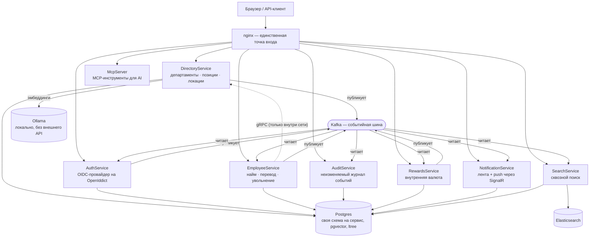

<div align="center">

# dsPortfolio

**Распределённая платформа для управления организацией — построена, чтобы честно пройти
через реальные проблемы распределённых систем от начала до конца, а не быть продуктом.**

[](README.md)
[](README.ru.md)


</div>

---

## Что это

Платформа управления организацией — департаменты, позиции, локации, сотрудники,
внутренняя валюта поощрений, уведомления в реальном времени и сквозной поиск — разбитая
на восемь взаимодействующих .NET-сервисов за одним шлюзом. Это **портфолио-проект**:
каждая часть существует потому, что я хотел построить и защитить конкретный ответ на
реальную проблему распределённых систем, а не потому, что это было нужно продукту. Это
видно по тому, что каждое нетривиальное решение оформлено ADR-документом с объяснением
*почему*, а не только *что* — см. [`docs/adr/`](docs/adr/).

Если оцениваете это как портфолио — быстрее всего начать с `docs/adr/`: семь коротких
записей о реальных компромиссах, написанных так, как я бы их защищал на дизайн-ревью, а
не задним числом подогнанных под красивую историю.

## Архитектура



Каждая стрелка в Kafka — это **транзакционный outbox**: запись домена и запись "сообщить
шине" коммитятся в одной транзакции, поэтому между "сохранили" и "остальная система узнала"
нет разрыва. Каждая стрелка из Kafka — это **идемпотентный консьюмер с retry и
dead-letter**, один и тот же паттерн, структурно скопированный пять раз (Audit,
Notification, Search, приветственный бонус в Rewards, сага найма→создания аккаунта) — а не
пять разных механизмов, которые нужно держать в голове по отдельности.

## Сервисы

| Сервис | Роль | Протоколы |
|---|---|---|
| **DirectoryService** | источник истины для оргструктуры — департаменты (иерархия на `ltree`), позиции, локации — плюс семантический поиск департаментов на pgvector | REST + gRPC-сервер, продюсер Kafka |
| **AuthService** | OIDC-провайдер на OpenIddict (`authorization_code` + PKCE, `client_credentials`), ASP.NET Identity, выдача аккаунтов | REST + OIDC, продюсер и консьюмер Kafka |
| **EmployeeService** | записи сотрудников — найм, перевод, увольнение — участник саги найм→выдача аккаунта | REST, gRPC-клиент → DirectoryService, продюсер и консьюмер Kafka |
| **AuditService** | неизменяемая запись каждого события на шине, с таблицей dead-letter для того, что не удалось обработать | Консьюмер Kafka, REST (только чтение) |
| **RewardsService** | внутренняя валютная книга — ручные начисления и автоматический приветственный бонус при найме | REST, продюсер и консьюмер Kafka |
| **NotificationService** | настоящий центр уведомлений — сохранённая лента, счётчик непрочитанных и живой push через SignalR, а не просто строка в логе | REST + SignalR, консьюмер Kafka |
| **SearchService** | сквозной поиск (сотрудники, департаменты, позиции, локации, история аудита) поверх индекса Elasticsearch, материализованного из того же потока событий | REST, консьюмер Kafka |
| **McpServer** | read-only [MCP](https://modelcontextprotocol.io)-инструменты (семантический поиск, оргдерево, поиск сотрудника) для AI-ассистентов | Streamable HTTP, JWT-аутентификация |

Весь REST-трафик идёт через nginx на `/`; gRPC между EmployeeService и DirectoryService —
только внутри сети, наружу не выходит никогда.

## Решения, о которых стоит почитать

Выбраны потому, что за каждым стоит реальный компромисс, а не потому, что это был
единственный вариант:

- **[Материализовать, а не разлетаться по сервисам](docs/adr/0007-elasticsearch-cross-service-search.md).**
  Сквозной поиск мог бы на каждое нажатие клавиши вживую опрашивать пять сервисов. Вместо
  этого `SearchService` слушает те же события Kafka, что и остальные консьюмеры, и строит
  свой индекс в Elasticsearch — поиск никогда не ждёт, пока поднимутся все пять сервисов
  разом, и не может случайно показать результат из данных, которые ему видеть не положено
  (он знает только то, что ему сообщили).
- **[Хореография вместо оркестрации](docs/adr/0003-choreography-saga-for-hire-employee.md)**
  для найма сотрудника → выдачи логин-аккаунта. Никакого нового процесса-оркестратора или
  отдельного хранилища состояния — ещё два консьюмера Kafka, в той же форме, что уже
  используется везде в этом коде. Неудачная попытка выдачи аккаунта видна прямо в записи
  сотрудника (`ProvisioningFailed`, с причиной), а не тихо зависшей строкой в базе.
- **[Никакой агрегации на API-шлюзе — пока не появились доказательства, что она нужна](docs/adr/0004-no-api-gateway-aggregation.md).**
  nginx специально сделан плоским reverse-proxy, и это прямо зафиксировано в документе:
  *"решение, которое стоит пересмотреть при появлении доказательств, а не постоянная
  позиция."* Спустя пять сервисов и два переписанных, доказательства появились (сквозной
  поиск), и именно этот ADR был пересмотрен — а не придуман новый план с нуля.
- **[SignalR вместо polling](docs/adr/0006-signalr-notification-center.md)** для уведомлений
  в реальном времени, с осознанным нюансом: JWT едет в query-строке WebSocket-URL
  (`?access_token=`), потому что WebSocket API браузера не может выставить заголовок
  `Authorization` на upgrade-хендшейке — это задокументированный паттерн ASP.NET Core, а не
  костыль, и ADR прямо об этом говорит, а не оставляет выглядеть подозрительно.
- **[Elasticsearch рядом с pgvector — осознанно, а не как дублирование](docs/adr/0007-elasticsearch-cross-service-search.md).**
  В проекте уже был инструмент семантического поиска для AI-ассистентов (эмбеддинги,
  косинусное сходство, под запрос на естественном языке). `search_as_you_type` в
  Elasticsearch отвечает на другой вопрос — "что совпадает с этими нажатиями клавиш, с
  ранжированием точное → префикс → подстрока" — для человека, печатающего в строку поиска.
  Один не заменяет другой; ADR объясняет, почему они сосуществуют, а не выбрано что-то одно.

## Что каждый сервис делает с параллелизмом и отказами

Осознанно спроектировано заранее, а не обнаружено как баги постфактум:

- **Транзакционный outbox** у каждого продюсера — нет разрыва между "сохранили" и
  "остальная система узнала".
- **Идемпотентные консьюмеры**, пять отдельных копий одной и той же формы: дедупликация по
  собственному id сообщения (уникальный индекс в Postgres, а для `SearchService` —
  собственная семантика upsert-по-детерминированному-id в Elasticsearch, задокументированная
  как единственное осознанное исключение из паттерна).
- **Retry, потом dead-letter, потом остановка**: три попытки, затем строка в
  `dead_letters` вместо тихо потерянного сообщения. Если не получается записать даже её,
  консьюмер останавливается на точном offset'е и продолжает пытаться, а не пропускает
  запись, которую так и не сохранил.
- **Оптимистичная конкурентность** у `Employee` через собственный `xmin` Postgres — два
  одновременных перевода одного сотрудника дают один успех и один `409`, никогда тихо
  потерянное обновление.
- **Устойчивость gRPC**: вызовы EmployeeService в DirectoryService несут retry, circuit
  breaker и таймаут — временный сбой DirectoryService не валит каждый найм подряд, а
  настоящий отказ проявляется как `503`, а не непрозрачный `500`.
- **Rate limiting** на `/auth/login`, `/auth/register`, семантическом поиске и на каждом
  write-эндпоинте — с разбивкой по IP клиента, а не общий глобальный лимит.

## Как запустить

```bash
docker compose up -d
```

Поднимает Postgres (`ltree` + `pgvector`), Kafka (KRaft, без Zookeeper), Redis,
Elasticsearch, Ollama (при первом старте скачивает `nomic-embed-text`), Mailpit, OTel
collector, nginx и все восемь сервисов. Миграции выполняются в отдельных, привратных
контейнерах до старта нужного им сервиса — не инлайн при каждом запуске, что билось бы само
с собой под `restart: always`, если бы миграция когда-нибудь упала на середине. Health
checks определяют, что `docker compose` сам считает готовым, для каждого сервиса.

```bash
curl http://localhost/api/departments/roots   # 401 без токена — всё за nginx требует его
```

`.env.example` документирует, что стоит переопределить локально; скопируйте в `.env`, если
нужно. Опциональный стек наблюдаемости (Tempo/Loki/Prometheus/Grafana) — за профилем
compose:

```bash
docker compose --profile obs up -d
```

| Открыто на localhost | Что |
|---|---|
| `:80` | nginx — каждый REST/OIDC-эндпоинт, `/hub/notifications` и `/mcp` |
| `:5434` | Postgres (база `platform`, своя схема на сервис) |
| `:9200` | Elasticsearch (только loopback, dev-уровень безопасности) |
| `:9092` | Kafka (только loopback, для локального CLI/GUI) |
| `:11434` | Ollama |
| `:8025` | Mailpit — перехватывает каждое письмо, которое AuthService отправляет локально |

Только внутри сети (никогда не публикуется на хост): gRPC-порт DirectoryService, Redis и
собственный HTTP-порт каждого сервиса — nginx единственный вход.

## Технологический стек

.NET 10 / ASP.NET Core, EF Core 10 + Npgsql, Dapper для тяжёлых по чтению
каталожных запросов,
[CSharpFunctionalExtensions](https://github.com/vkhorikov/CSharpFunctionalExtensions)
(`Result<T, Error>` от начала до конца, без исключений для ожидаемых ошибок),
FluentValidation, Serilog → OpenTelemetry, OpenIddict, Confluent.Kafka, официальный клиент
`Elastic.Clients.Elasticsearch`, SignalR, HybridCache поверх Redis, Testcontainers + Respawn
для интеграционных тестов, k6 для нагрузочных. Фронтенд: Next.js (App Router) + React +
TanStack Query + shadcn/ui.

## Тестирование

```bash
dotnet test backend/backend.slnx
```

107 тестов: наборы на границы архитектуры (NetArchTest — слои домена не могут зависеть от
инфраструктуры) и интеграционные наборы, каждый поднимает свой собственный Postgres — а для
`SearchService` ещё и свой Elasticsearch — через Testcontainers, а не делят состояние или
мокают базу. Покрыто осознанно не "всё"; некоторые вещи (например, падение живой базы
посреди запроса) проверяются вручную на реальном стеке вместо автоматизации, и это отмечено
там, где применимо, а не оставлено по умолчанию.

CI (`.github/workflows/ci.yml`) собирает и прогоняет весь набор на каждый push и pull
request, плюс отдельная задача собирает Docker-образ каждого сервиса без публикации, чтобы
поймать сломанный Dockerfile раньше, чем это сделает `docker compose up`.

```bash
cd load-tests/k6
docker run --rm --network host -v "$(pwd)":/scripts -w /scripts grafana/k6 run main.js
```

## Структура проекта

```
backend/
  {Service}/
    {Service}.Domain                    # сущности, value objects, инварианты — без зависимости от фреймворка
    {Service}.Application                 # хендлеры, валидация, Result<T, Error>           (у части сервисов)
    {Service}.Infrastructure.{Postgres,*}  # EF Core, Dapper, gRPC-клиенты, Elasticsearch, Kafka
    {Service}.Web                       # контроллеры, Program.cs, DI
    {Service}.ArchitectureTests         # правила границ слоёв (NetArchTest)
    {Service}.IntegrationTests          # Testcontainers + WebApplicationFactory
  Shared/                               # Envelope, Error, outbox, health checks, CORS — ничего сервис-специфичного
docs/adr/                               # архитектурные решения, написанные от "почему", а не подогнанные задним числом
load-tests/k6/                          # сценарии нагрузочного тестирования
docker/                                 # nginx, инициализация Postgres
frontend/                               # клиент на Next.js (отдельная задача, свой README)
```

## Честный статус

Бэкенд функционально завершён для всего, что описано в `docs/adr/`, и каждая фича в этом
README проверена вживую на реально запущенном стеке, а не только юнит-тестами. Что реально
не закончено, сказано прямо, а не сглажено:

- **У фронтенда вообще нет подключённой аутентификации** — ни OIDC-клиента, ни роута
  `/auth/callback`, ни токена, прикреплённого хоть к одному запросу. Сейчас рендерится один
  read-only экран (департаменты) поверх бэкенда, который везде остальном требует
  bearer-токен, которого он никогда не отправляет. Это реальный следующий этап, а не сноска.
- Сквозной поиск покрывает пять типов сущностей; пока не покрывает путь иерархии
  департамента в результатах, а также обновление/удаление позиций и локаций — обе сущности
  сегодня поддерживают только создание, обновлять и удалять пока нечего.
- Стек наблюдаемости (Tempo/Loki/Prometheus/Grafana) подключён и работает, но опционален по
  дизайну (`--profile obs`) — трейсы и метрики есть, дашборды минимальны.

Лучше пусть портфолио-README честно скажет "вот чего реально не хватает и почему", чем
звучит как рекламный текст для проекта, который никто не собирается выводить в продакшен.
