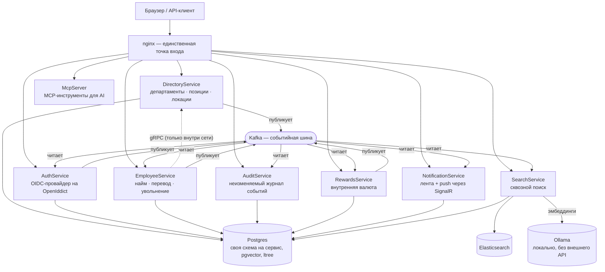

<div align="center">

# dsPortfolio

**Распределённая платформа для управления организацией — построена, чтобы честно пройти
через реальные проблемы распределённых систем от начала до конца, а не быть продуктом.**

[](README.md)
[](README.ru.md)


</div>

---

## Что это

Платформа управления организацией — департаменты, позиции, локации, сотрудники,
внутренняя валюта поощрений, уведомления в реальном времени и сквозной поиск — разбитая
на восемь взаимодействующих .NET-сервисов за одним шлюзом. Это **портфолио-проект**:
каждая часть существует потому, что я хотел построить и защитить конкретный ответ на
реальную проблему распределённых систем, а не потому, что это было нужно продукту. Это
видно по тому, что каждое нетривиальное решение оформлено ADR-документом с объяснением
*почему*, а не только *что* — см. [`docs/adr/`](docs/adr/).

## Тур на две минуты

Три вещи, на которые стоит потратить время, именно в таком порядке, и рядом с каждой её доказательство:

1. **ИИ-ассистент, который может предлагать изменения, но не может их делать, и защита измерена.**
   Локальная модель (gpt-oss-20b через llama.cpp, без внешнего API) читает организацию от вашего имени и предлагает
   найм, перевод и начисления; вы читаете карточку, которую *сервер* нарисовал из подписанного плана, и подтверждаете
   сами. Идентификаторы, которые передаёт модель, проверяются у сервисов-владельцев, деньги идут отдельным маршрутом с
   потолком на одно начисление и суточной квотой, которую держит сам журнал. Затем я измерил это на враждебном тексте,
   подложенном в данные ([ADR 0016](docs/adr/0016-agent-proposes-user-confirms.md),
   [ADR 0017](docs/adr/0017-approval-is-informed-and-bounded.md)). Честный итог: модель по-прежнему можно уговорить
   предложить лишнее; гарантируется, что это читаемо, ограничено и выполняется только по клику.
2. **Платформа, которую ломали нарочно.** Транзакционный outbox и идемпотентные потребители в каждом сервисе,
   нагрузочный тест k6, нашедший три настоящих бага раньше, чем дал число, хаос-тесты, замораживающие брокер и базу и
   проверяющие, что ни один приветственный бонус не потерян и не удвоен, правила SLO.
3. **Поиск и история с цифрами, а не прилагательными.** Ключевой, смысловой и гибридный поиск на размеченных запросах
   ([ADR 0018](docs/adr/0018-hybrid-search-measured.md): гибрид *сравнялся* со смысловым, но не обогнал его) и «машина
   времени» оргструктуры, собранная сверткой журнала событий
   ([ADR 0019](docs/adr/0019-org-time-machine-from-the-event-log.md)); попутно исправлен реальный дефект: аудит
   записывал время получения сообщения, а не время самого события.

Запустить самому: `scripts/demo.sh up` (см. [Как запустить](#как-запустить)); короткий видео-обзор с субтитрами —
[`docs/demo/video/portfolio-overview.mp4`](docs/demo/video/portfolio-overview.mp4), а полный интерактивный проход
расписан в [`docs/demo/storyboard.md`](docs/demo/storyboard.md). Обоснование каждого решения — в [`docs/adr/`](docs/adr/):
24 коротких записей о реальных компромиссах, написанных так, как я бы их защищал на дизайн-ревью, а не задним числом
подогнанных под красивую историю. Чего нет, перечислено прямо в разделе [Честный статус](#честный-статус).

## Архитектура

Полная карта (контекст системы, контейнеры, путь найма, карта контекстов DDD и event storming найма) — в
[`docs/architecture/`](docs/architecture/README.md) (на английском). Обзор:


```mermaid
flowchart TB
    Client["Браузер / API-клиент"] --> Nginx["nginx — единственная точка входа"]

    Nginx --> Directory["DirectoryService<br/>департаменты · позиции · локации"]
    Nginx --> Auth["AuthService<br/>OIDC-провайдер на OpenIddict"]
    Nginx --> Employee["EmployeeService<br/>найм · перевод · увольнение"]
    Nginx --> Audit["AuditService<br/>неизменяемый журнал событий"]
    Nginx --> Rewards["RewardsService<br/>внутренняя валюта"]
    Nginx --> Notification["NotificationService<br/>лента + push через SignalR"]
    Nginx --> Search["SearchService<br/>сквозной поиск"]
    Nginx --> Mcp["McpServer<br/>MCP-инструменты для AI"]

    Employee -. "gRPC (только внутри сети)" .-> Directory

    Directory -- публикует --> Kafka(["Kafka — событийная шина"])
    Employee -- публикует --> Kafka
    Auth -- публикует --> Kafka
    Rewards -- публикует --> Kafka

    Kafka -- читает --> Audit
    Kafka -- читает --> Notification
    Kafka -- читает --> Search
    Kafka -- читает --> Rewards
    Kafka -- читает --> Auth
    Kafka -- читает --> Employee

    Search --> ES[("Elasticsearch")]
    Directory --> PG[("Postgres<br/>своя схема на сервис, pgvector, ltree")]
    Auth --> PG
    Employee --> PG
    Audit --> PG
    Rewards --> PG
    Notification --> PG
    Search --> PG
    Search -- эмбеддинги --> Ollama[("Ollama<br/>локально, без внешнего API")]
```

Каждая стрелка в Kafka — это **транзакционный outbox**: запись домена и запись "сообщить
шине" коммитятся в одной транзакции, поэтому между "сохранили" и "остальная система узнала"
нет разрыва. Каждая стрелка из Kafka — это **идемпотентный консьюмер с retry и
dead-letter**, один и тот же паттерн, структурно скопированный пять раз (Audit,
Notification, Search, приветственный бонус в Rewards, сага найма→создания аккаунта) — а не
пять разных механизмов, которые нужно держать в голове по отдельности.

## Сервисы

| Сервис | Роль | Протоколы |
|---|---|---|
| **DirectoryService** | источник истины для оргструктуры — департаменты (иерархия на `ltree`), позиции, локации — плюс переименование департамента | REST + gRPC-сервер, продюсер Kafka |
| **AuthService** | OIDC-провайдер на OpenIddict (`authorization_code` + PKCE, `client_credentials`), ASP.NET Identity, выдача аккаунтов | REST + OIDC, продюсер и консьюмер Kafka |
| **EmployeeService** | записи сотрудников — найм, перевод, увольнение — участник саги найм→выдача аккаунта | REST, gRPC-клиент → DirectoryService, продюсер и консьюмер Kafka |
| **AuditService** | неизменяемая запись каждого события на шине, с таблицей dead-letter для того, что не удалось обработать | Консьюмер Kafka, REST (только чтение) |
| **RewardsService** | внутренняя валютная книга — ручные начисления и автоматический приветственный бонус при найме | REST, продюсер и консьюмер Kafka |
| **NotificationService** | настоящий центр уведомлений — сохранённая лента, счётчик непрочитанных и живой push через SignalR, а не просто строка в логе | REST + SignalR, консьюмер Kafka |
| **SearchService** | сквозной поиск (сотрудники, департаменты, позиции, локации, история аудита) поверх индекса Elasticsearch, материализованного из того же потока событий | REST, консьюмер Kafka |
| **McpServer** | read-only [MCP](https://modelcontextprotocol.io)-инструменты (семантический поиск, оргдерево, поиск сотрудника) для AI-ассистентов | Streamable HTTP, JWT-аутентификация |

Весь REST-трафик идёт через nginx на `/`; gRPC между EmployeeService и DirectoryService —
только внутри сети, наружу не выходит никогда.

## Решения, о которых стоит почитать

Выбраны потому, что за каждым стоит реальный компромисс, а не потому, что это был
единственный вариант:

- **[Материализовать, а не разлетаться по сервисам](docs/adr/0007-elasticsearch-cross-service-search.md).**
  Сквозной поиск мог бы на каждое нажатие клавиши вживую опрашивать пять сервисов. Вместо
  этого `SearchService` слушает те же события Kafka, что и остальные консьюмеры, и строит
  свой индекс в Elasticsearch — поиск никогда не ждёт, пока поднимутся все пять сервисов
  разом, и не может случайно показать результат из данных, которые ему видеть не положено
  (он знает только то, что ему сообщили).
- **[Хореография вместо оркестрации](docs/adr/0003-choreography-saga-for-hire-employee.md)**
  для найма сотрудника → выдачи логин-аккаунта. Никакого нового процесса-оркестратора или
  отдельного хранилища состояния — ещё два консьюмера Kafka, в той же форме, что уже
  используется везде в этом коде. Неудачная попытка выдачи аккаунта видна прямо в записи
  сотрудника (`ProvisioningFailed`, с причиной), а не тихо зависшей строкой в базе.
- **[Никакой агрегации на API-шлюзе — пока не появились доказательства, что она нужна](docs/adr/0004-no-api-gateway-aggregation.md).**
  nginx специально сделан плоским reverse-proxy, и это прямо зафиксировано в документе:
  *"решение, которое стоит пересмотреть при появлении доказательств, а не постоянная
  позиция."* Спустя пять сервисов и два переписанных, доказательства появились (сквозной
  поиск), и именно этот ADR был пересмотрен — а не придуман новый план с нуля.
- **[SignalR вместо polling](docs/adr/0006-signalr-notification-center.md)** для уведомлений
  в реальном времени, с осознанным нюансом: JWT едет в query-строке WebSocket-URL
  (`?access_token=`), потому что WebSocket API браузера не может выставить заголовок
  `Authorization` на upgrade-хендшейке — это задокументированный паттерн ASP.NET Core, а не
  костыль, и ADR прямо об этом говорит, а не оставляет выглядеть подозрительно.
- **[Elasticsearch рядом с pgvector — осознанно, а не как дублирование](docs/adr/0007-elasticsearch-cross-service-search.md).**
  В проекте уже был инструмент семантического поиска для AI-ассистентов (эмбеддинги,
  косинусное сходство, под запрос на естественном языке). `search_as_you_type` в
  Elasticsearch отвечает на другой вопрос — "что совпадает с этими нажатиями клавиш, с
  ранжированием точное → префикс → подстрока" — для человека, печатающего в строку поиска.
  Один не заменяет другой; ADR объясняет, почему они сосуществуют, а не выбрано что-то одно.

- **[Агент предлагает, человек подтверждает, и подтверждение должно быть осознанным](docs/adr/0017-approval-is-informed-and-bounded.md).**
  MCP-сервер не видит сообщения пользователя, поэтому никакая серверная проверка не решит «просили ли это». Зато он может
  отнять решения у модели: каждый id проверяется у сервиса-владельца, план записывается именами, которые сервер прочитал,
  карточку подтверждения рисует сервер из подписанного плана, а у денег свои лимиты, которые держит журнал. ADR
  формулирует гарантию узко намеренно: первая проверка показала, что потолок *ограничивает* подложенное начисление, но
  не *останавливает* его.
- **[Сначала измерить поиск, потом говорить, что он лучше](docs/adr/0018-hybrid-search-measured.md).** Гибридный поиск
  строился на допущении плана, что переименование отдела запустит пересчёт эмбеддинга; переименования не существовало
  (в домене был `SetName`, и ничто его не вызывало). Измерение показало, что гибрид сравнялся со смысловым поиском, а не
  обогнал его, и нашло дефект ключевого поиска в его промахах.
- **[Оргструктура на прошлую дату, свёрнутая из журнала событий](docs/adr/0019-org-time-machine-from-the-event-log.md)**
  вместо второй читающей модели: второй источник может разойтись с журналом. Работа выявила, что аудит ставил время
  *получения*, поэтому собственное время события теперь едет в заголовке.

## Что каждый сервис делает с параллелизмом и отказами

Осознанно спроектировано заранее, а не обнаружено как баги постфактум:

- **Транзакционный outbox** у каждого продюсера — нет разрыва между "сохранили" и
  "остальная система узнала".
- **Идемпотентные консьюмеры**, пять отдельных копий одной и той же формы: дедупликация по
  собственному id сообщения (уникальный индекс в Postgres, а для `SearchService` —
  собственная семантика upsert-по-детерминированному-id в Elasticsearch, задокументированная
  как единственное осознанное исключение из паттерна).
- **Retry, потом dead-letter, потом остановка**: три попытки, затем строка в
  `dead_letters` вместо тихо потерянного сообщения. Если не получается записать даже её,
  консьюмер останавливается на точном offset'е и продолжает пытаться, а не пропускает
  запись, которую так и не сохранил.
- **Оптимистичная конкурентность** у `Employee` через собственный `xmin` Postgres — два
  одновременных перевода одного сотрудника дают один успех и один `409`, никогда тихо
  потерянное обновление.
- **Устойчивость gRPC**: вызовы EmployeeService в DirectoryService несут retry, circuit
  breaker и таймаут — временный сбой DirectoryService не валит каждый найм подряд, а
  настоящий отказ проявляется как `503`, а не непрозрачный `500`.
- **Rate limiting** на `/auth/login`, `/auth/register`, семантическом поиске и на каждом
  write-эндпоинте — с разбивкой по IP клиента, а не общий глобальный лимит.

## Как запустить

```bash
scripts/demo.sh up        # бэкенд-стек, ждёт готовности и подсказывает, что делать дальше
scripts/demo.sh history   # датированная вымышленная организация для страницы /history
scripts/demo.sh llm       # локальная модель ассистента (нужны GPU-устройство и ~12 ГБ ОЗУ)
```

`scripts/demo.sh` — тонкая обёртка над командами ниже; секретов он не касается (значения берутся из вашего `.env` или
хранилища). Фронтенд запускается отдельно из `frontend/` через запускатель хранилища, потому что он держит OAuth-токены
на сервере. Размещённого демо нет намеренно: ассистенту нужна локальная GPU-модель, а облачная LLM — это постоянные
расходы и чужой бесплатный API. План видео — в [`docs/demo/storyboard.md`](docs/demo/storyboard.md).

```bash
docker compose up -d
```

Поднимает Postgres (`ltree` + `pgvector`), Kafka (KRaft, без Zookeeper), Redis,
Elasticsearch, Ollama (при первом старте скачивает `nomic-embed-text`), Mailpit, OTel
collector, nginx и все восемь сервисов. Миграции выполняются в отдельных, привратных
контейнерах до старта нужного им сервиса — не инлайн при каждом запуске, что билось бы само
с собой под `restart: always`, если бы миграция когда-нибудь упала на середине. Health
checks определяют, что `docker compose` сам считает готовым, для каждого сервиса.

```bash
curl http://localhost/api/departments/roots   # 401 без токена — всё за nginx требует его
```

`.env.example` документирует, что стоит переопределить локально; скопируйте в `.env`, если
нужно. Опциональный стек наблюдаемости (Tempo/Loki/Prometheus/Grafana) — за профилем
compose:

```bash
docker compose --profile obs up -d
```

| Открыто на localhost | Что |
|---|---|
| `:80` | nginx — каждый REST/OIDC-эндпоинт, `/hub/notifications` и `/mcp` |
| `:5434` | Postgres (база `platform`, своя схема на сервис) |
| `:9200` | Elasticsearch (только loopback, dev-уровень безопасности) |
| `:9092` | Kafka (только loopback, для локального CLI/GUI) |
| `:11434` | Ollama |
| `:8025` | Mailpit — перехватывает каждое письмо, которое AuthService отправляет локально |

Только внутри сети (никогда не публикуется на хост): gRPC-порт DirectoryService, Redis и
собственный HTTP-порт каждого сервиса — nginx единственный вход.

## Технологический стек

.NET 10 / ASP.NET Core, EF Core 10 + Npgsql, Dapper для тяжёлых по чтению
каталожных запросов,
[CSharpFunctionalExtensions](https://github.com/vkhorikov/CSharpFunctionalExtensions)
(`Result<T, Error>` от начала до конца, без исключений для ожидаемых ошибок),
FluentValidation, Serilog → OpenTelemetry, OpenIddict, Confluent.Kafka, официальный клиент
`Elastic.Clients.Elasticsearch`, SignalR, HybridCache поверх Redis, Testcontainers + Respawn
для интеграционных тестов, k6 для нагрузочных. Фронтенд: Next.js (App Router) + React +
TanStack Query + shadcn/ui.

## Тестирование

```bash
dotnet test backend/backend.slnx
```

632 теста в 16 проектах за один прогон, все зелёные (один опциональный замер по умолчанию пропускается).
Интеграционные тесты по сервисам: McpServer 145, Auth 141, Audit 53, Directory 52, Search 52, Rewards 43,
Notification 17, Employee 17; плюс Shared 53, пары контрактов событий 35, хаос-тесты 2 и наборы на границы архитектуры
(NetArchTest — слои домена не могут зависеть от инфраструктуры) 22. Каждый интеграционный проект поднимает свой Postgres —
а для `SearchService` ещё и свой Elasticsearch — через Testcontainers, а не делит состояние или мокает базу.
Покрыто осознанно не "всё"; некоторые вещи (например, падение живой базы
посреди запроса) проверяются вручную на реальном стеке вместо автоматизации, и это отмечено
там, где применимо, а не оставлено по умолчанию.

CI (`.github/workflows/ci.yml`) собирает и прогоняет весь набор на каждый push и pull
request, плюс отдельная задача собирает Docker-образ каждого сервиса без публикации, чтобы
поймать сломанный Dockerfile раньше, чем это сделает `docker compose up`.

```bash
cd load-tests/k6
docker run --rm --network host -v "$(pwd)":/scripts -w /scripts grafana/k6 run main.js
```

## Структура проекта

```
backend/
  {Service}/
    {Service}.Domain                    # сущности, value objects, инварианты — без зависимости от фреймворка
    {Service}.Application                 # хендлеры, валидация, Result<T, Error>           (у части сервисов)
    {Service}.Infrastructure.{Postgres,*}  # EF Core, Dapper, gRPC-клиенты, Elasticsearch, Kafka
    {Service}.Web                       # контроллеры, Program.cs, DI
    {Service}.ArchitectureTests         # правила границ слоёв (NetArchTest)
    {Service}.IntegrationTests          # Testcontainers + WebApplicationFactory
  Shared/                               # Envelope, Error, outbox, health checks, CORS — ничего сервис-специфичного
docs/adr/                               # архитектурные решения, написанные от "почему", а не подогнанные задним числом
load-tests/k6/                          # сценарии нагрузочного тестирования
docker/                                 # nginx, инициализация Postgres
frontend/                               # клиент на Next.js (отдельная задача, свой README)
```

## Фронтенд

Next.js (App Router), с аутентификацией, сделанной так, как её реально стоит защищать на
ревью, а не самым быстрым способом заставить кнопку "войти" работать:

- **Auth.js с сессиями на базе данных**, а не JWT в куке — браузер получает только
  непрозрачный, `HttpOnly` идентификатор сессии. OAuth access/refresh токены живут на
  сервере, в отдельной Postgres-схеме `web_auth`, и никогда не попадают в состояние React,
  TanStack Query или `localStorage`.
- **Same-origin BFF-прокси** (`app/api/backend/[...path]/route.ts`) — единственный способ,
  которым браузер достаёт бэкенд: он прикрепляет bearer-токен на сервере, отклоняет
  cross-origin мутации и пропускает только явный allowlist путей бэкенда, а не всё, что
  открывает nginx.
- Департаменты, Позиции, Локации, Люди (найм/перевод) и лента активности на базе
  `AuditService` собраны с настоящими формами создания, пагинацией, фильтрами и доступными
  (accessible) состояниями загрузки/пустоты/ошибки — не просто read-only списки.
- Глобальный поиск в командном меню (SearchService, по умолчанию гибридный режим) и колокольчик уведомлений на REST-ленте
  NotificationService; форма начисления и баланс кошелька (RewardsService) на странице людей.
- **Страница ассистента**: локальная модель предлагает изменения, а человек подтверждает карточку, которую сервер
  нарисовал из подписанного плана; подтверждение начислений идёт через недавнюю повторную проверку (step-up), которую
  BFF передаёт так, что браузер не держит OAuth-токен.
- **Страница истории организации**: ползунок даты над деревом отделов и списком людей на этот день, собранный из журнала
  аудита ([ADR 0019](docs/adr/0019-org-time-machine-from-the-event-log.md)).

## Честный статус

Что проверено, а что нет, сказано прямо, а не замазано:

- **Размещённого демо нет, и это решение.** Ассистенту нужна локальная GPU-модель, а облачная LLM — постоянные расходы и
  чужой бесплатный API. Всё запускается локально (`scripts/demo.sh`); план видео — в
  [`docs/demo/storyboard.md`](docs/demo/storyboard.md).
- **Живой push уведомлений построен, но сквозно не запускался.** Браузер открывает хаб SignalR 60-секундным билетом,
  который для него получает BFF, а не OAuth-токеном ([ADR 0022](docs/adr/0022-hub-tickets.md)); колокольчик
  перезапрашивает ленту при пуше и оставляет опрос как запасной путь. Сервис билетов, рукопожатие хаба и логика клиента
  проверены тестами; реальный браузер через nginx с полученным пушем не запускался (нужна авторизованная сессия).
  Билет нельзя отозвать в пределах его минуты, а нескольким экземплярам нужен один ключ подписи.
- **Ассистента по-прежнему можно уговорить предложить лишнее.** Измерение говорит, что гарантируется (читаемо,
  ограничено, выполняется только по клику) и что нет (подложенная инструкция всё ещё может дать корректную ограниченную
  карточку). Проверка — 3 прогона 9 задач на одной локальной модели: направление, а не доли. У ассистента теперь есть
  инструмент, перечисляющий должности отдела (`list_positions_by_department`); он добавлен после замера, поэтому замер
  сделан без него и с ним не перезапускался.
- **Гибридный поиск сравнялся со смысловым и не обогнал его**, на 43 размеченных запросах по синтетической организации.
  Дефект ключевого поиска, найденный в первом прогоне, исправлен после просмотра результатов, поэтому таблица оптимистична
  для гибрида. Отдел эмбеддится в одном месте, в SearchService;
  MCP-инструмент читает его ([ADR 0020](docs/adr/0020-one-embedding-per-department.md)), поэтому зависит от этого
  сервиса и сквозно не измерялся. Документы сотрудников и должностей перестраиваются при
  переименовании их отдела; проиндексированные до этого хранят старое название до своего следующего события. Поиск покрывает пять типов сущностей. Позиции и локации можно только создавать: у
  DirectoryService нет их изменения и удаления, поэтому события не из чего выпускать и поддерживать нечего.
- **История организации начинается с момента, когда начал работать журнал аудита**, записи, сохранённые до того, как
  время события стало ехать с сообщением, хранят время получения, а понятия «руководитель отдела» в домене нет, поэтому
  вопрос «кто руководил в марте» не имеет ответа.
- **Страницы браузера (ассистент, история) покрыты линтом, проверкой типов, продакшн-сборкой и юнит-тестами их логики,
  а не автоматизированным браузерным тестом.** Это верно и для фронтенда в целом.
- Стек наблюдаемости (Tempo/Loki/Prometheus/Grafana) подключён и работает, но опционален по дизайну (`--profile obs`) —
  трейсы и метрики есть, дашборды минимальны. Bearer-токен из строки запроса в атрибуты трасс не попадает:
  спан входящего запроса скрывает все значения запроса, и тест это закрепляет (падает, если скрытие отключить).
  Access-лог nginx его тоже маскирует, лог запросов пишет только путь.

Лучше пусть портфолио-README честно скажет «вот чего реально не хватает и почему», чем звучит как рекламный текст для
проекта, который никто не собирается выводить в продакшн.
