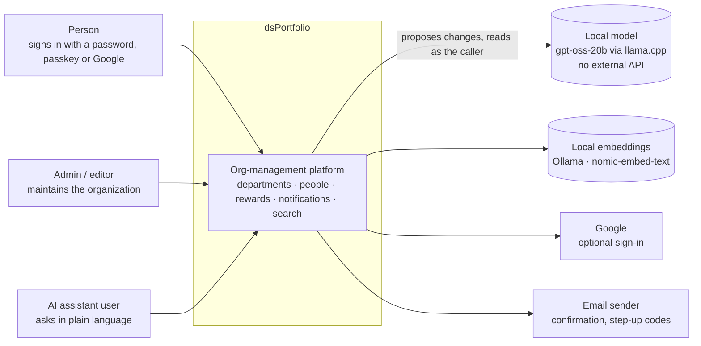
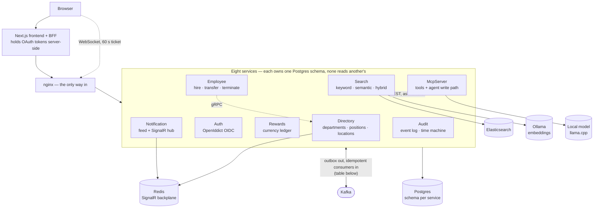
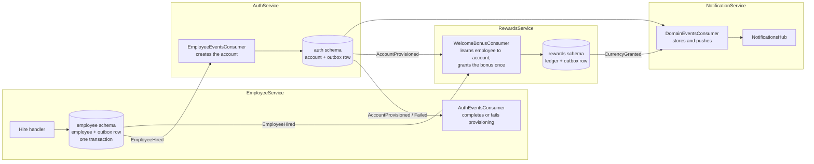
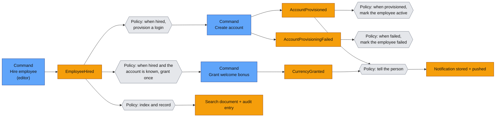

# Architecture map

Three views of the same system, from outside in: who uses it (C4 level 1), what runs and how it talks (level 2), how
the services relate as domains (DDD context map), and what actually happens when someone is hired (event storming).
Everything here was read from the code and configuration, not from memory; where something is a decision rather than a
fact, the ADR is linked.

## 1. System context (C4 level 1)

## 2. Containers (C4 level 2)

nginx is the only entry. No service publishes its HTTP port to the host. Each service owns one Postgres schema and
reads nothing from another ([ADR 0001](../adr/0001-schema-per-service-shared-database.md)); services learn about each other's changes
only through events, or through a service's own API.

**Topics: who writes, who reads** (from each service's configuration):

| Topic | Written by | Read by |
|---|---|---|
| `directory.events` | DirectoryService | SearchService, AuditService |
| `employee.events` | EmployeeService | AuthService, RewardsService, NotificationService, SearchService, AuditService |
| `auth.events` | AuthService | EmployeeService, RewardsService, NotificationService, SearchService |
| `rewards.events` | RewardsService | NotificationService, SearchService |

Every write to a topic goes through a transactional outbox ([ADR 0002](../adr/0002-outbox-pattern-for-integration-events.md));
every read is an idempotent consumer with bounded retries and a dead-letter table.

## 3. Key components of one container: the hire path

The most interesting path crosses four services. Only the pieces involved are drawn.

## 4. Context map (DDD)

Each service is a bounded context with its own model of the word "employee".

| Context | Owns | Relationship to others |
|---|---|---|
| **Directory** | departments (tree), positions, locations | **Upstream.** Publishes the department and position facts; EmployeeService calls it over gRPC to check a department and position exist (customer-supplier). |
| **Employee** | the employee record and its lifecycle | Downstream of Directory (validates against it), **partner** of Auth in the hire saga: neither can finish without the other, so the saga is the contract ([ADR 0003](../adr/0003-choreography-saga-for-hire-employee.md)). |
| **Auth** | accounts, sessions, tokens | Consumes `EmployeeHired`; publishes `AccountProvisioned` / `Failed`. |
| **Rewards** | the currency ledger | Downstream of Employee and Auth; needs the employee-to-account mapping and builds its own from `AccountProvisioned`. |
| **Notification, Search, Audit** | feed, index, event log | **Conformist, open-ended consumers:** they take whatever the producers publish and never ask for changes. |
| **McpServer** | the assistant's tools and plan signing | **Anticorruption layer:** a model's idea of a department or position is never trusted; ids are resolved by the owning service ([ADR 0016](../adr/0016-agent-proposes-user-confirms.md), [0017](../adr/0017-approval-is-informed-and-bounded.md)). |

The one pattern that holds everywhere: **a consumer keeps its own local copy of the event shape** instead of sharing
a contract library, so a producer can add a field without a coordinated release, and a breaking change fails a contract
test instead of production. The weakness is that nothing yet *versions* those contracts or checks them across services;
that is the next item on the foundation roadmap.

## 5. Event storming: hiring someone

Read left to right as time; orange are events, blue are commands, the policy lines say "whenever X happens, do Y".

**What the storm shows, and what it does not.**
- The failure path (`AccountProvisioningFailed`) is a first-class event with its own reaction, not an exception.
- The welcome bonus is triggered from two events, because Rewards needs both the employee and the account it belongs
  to; it grants **once** per employee, which a concurrency test checks.
- The storm assumes nothing times out. There is no compensation that removes the employee if provisioning fails, only
  a marked state: [ADR 0003](../adr/0003-choreography-saga-for-hire-employee.md) records why a two-step saga stays
  choreographed, and says it would be reconsidered if a third participant joined.
