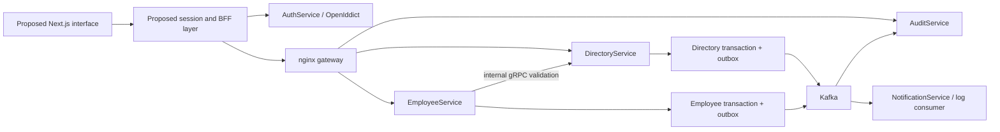
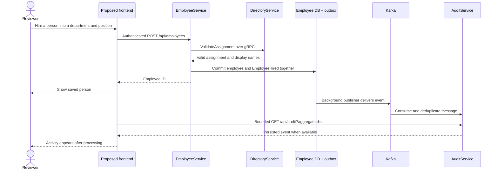

# DS — People & Organization

Status: implementation proposal, grounded in the repository at `ecd92ce`.
Audience: international engineering reviewers and people-operations users.
Product language: English. Reference conventions: the author's `education-platform-dev` frontend.

## Product story

DS connects an organization's structure to the people working inside it. The portfolio's central demonstration is a real workflow: create a department and position, hire a person, transfer them, and inspect the resulting audit record.

The interface should make the business workflow understandable before explaining the distributed system underneath it. A separate Engineering view exposes those decisions for reviewers.

## What exists today

| Area | Source evidence | Frontend implication |
| --- | --- | --- |
| Foundation | `frontend/package.json`: Next.js 16.1.1, React 19.2.3, strict TypeScript, Tailwind v4, Radix/shadcn, Lucide, Axios, TanStack Query v5 | Evolve this stack; no framework migration needed. Verify compatible patched releases before implementation. |
| Existing UI | Starter home, sidebar, department list/detail and lazy children | These are an early prototype, not a complete authenticated application. |
| Authentication | AccountController: register/login/logout. AuthorizationController: authorize/token/userinfo/logout | Integrate OpenIddict; regular registration creates a viewer. Editor access needs a documented provisioning mechanism. |
| Departments | DepartmentController: roots, lazy children, detail, top positions, location filter, create, reparent, location assignment, soft-delete | Tree and detail views can expose actual existing business operations. |
| Positions | PositionController: create only | Add an authenticated read/lookup contract for list screens and valid hire/transfer selectors. |
| Locations | LocationController: create and filtered/paginated reads | Existing query joins department locations: verify/fix duplicate and unattached-location behavior before a global management screen. |
| Employees | EmployeeController: list, get, hire, transfer | Directory and hiring/transfer forms; no invented edit/delete/termination controls. |
| Audit | AuditController: page/pageSize, aggregateId, event payload and timestamps | Paginated activity and entity history; no actor name, total count or live transport is currently exposed. |
| Notifications | NotificationService worker, described in issue #11 | Independent event consumer writing logs. An inbox needs persistence and a read API. |

Backend context: [authentication #7](https://github.com/1babii1/DS/issues/7), [employees and gRPC #9](https://github.com/1babii1/DS/issues/9), [Kafka and audit #11](https://github.com/1babii1/DS/issues/11).

### Integration defects to remove

- `entities/departments/api/departments.api.ts` uses old absolute localhost routes and turns failed requests into `[]` or `null`. Fix routes and preserve errors before interpreting an empty state.
- Department transport dates are typed as `Date`, but JSON carries strings. `parentId` is nullable; hierarchy children can also be null. Detail and hierarchy responses need separate accurate types.
- The current detail screen assumes `hasMoreChildren` on a response that does not expose it. Preserve prefetched children and implement lazy pagination using the appropriate contract.
- The module-level QueryClient needs deliberate lifecycle ownership; private cache must clear on logout/account changes.
- Directory writes use EndpointResult, Directory reads use raw DTOs, and Employee failures can be arrays or ProblemDetails. A single raw response assumption will break integration.
- An employee's department/position names are snapshots taken during assignment, not always the current names from DirectoryService.
- The available shell has Node 18.19.1. Next.js 16 requires Node 20.9 or later; select a supported LTS runtime before installing/building.

## Recommended visual direction

Working identity: **DS / People & Organization**. Navigation can use the concise product name **Directory**. Brand naming remains reversible.

Apply the author's `saas-product-ui-system` skill, which combines `ui-ux-design-system` and `saas-ui-ux-designer-with-flex`: dark-first with light-mode parity, neutral surfaces, balanced workspace density and compact operational tables. Use graphite navigation, a restrained green action color, and clear typographic hierarchy; the light theme has a warm neutral canvas. The first useful screen is a workspace, with compact summaries and an activity stream. Give the organization tree space to express hierarchy; use tables for comparison and side panels for inspecting a person without losing context.

Suggested starting tokens, subject to rendered contrast verification:

| Token | Light direction | Dark direction |
| --- | --- | --- |
| Canvas | `#F6F7F4` | `#131A17` |
| Surface | `#FFFFFF` | `#1C2520` |
| Text | `#18231D` | `#F0F4F1` |
| Secondary text | `#526159` | `#ABB9B0` |
| Primary action | `#245E43`, white label | `#A8D7B8`, dark label |
| Border | `#DCE3DD` | `#35453B` |

Use one primary sans-serif family with a system fallback; monospace only for identifiers and engineering details. Start with the installed Geist family; avoid adding fonts without a visible reason. Use a 4px spacing scale and a small family of corner radii. Light/dark themes are useful, but both need independent contrast checks.

### Screen composition

| Screen | Main interaction | Portfolio value |
| --- | --- | --- |
| Overview | Continue a task, inspect recent activity, navigate to teams | Real derived summaries; no fabricated growth charts or incomplete totals |
| People | Search/filter directory, inspect person, hire or transfer | URL state, data tables, forms, asynchronous feedback |
| Organization | Expand branches, inspect department, change parent | Lazy data, hierarchy, accessible disclosure, cache invalidation |
| Department detail | People, locations, structure, entity activity | Composition across service boundaries |
| Positions | Browse assignments and create a position | Dependent selectors and actual department constraints |
| Locations | Search/filter locations, create and assign | Timezones, forms and pagination |
| Activity | Filter by entity, paginate, expand event details | Eventual consistency with an understandable user experience |
| Engineering | Follow architecture and one event's journey | Explicit tradeoffs, repository links, system design literacy |

A narrow viewport gets a real mobile navigation sheet, stacked detail panels and intentionally scrollable tables with accessible labels. It must not inherit desktop offsets or shrink a wide organization diagram until text becomes unreadable.

### Motion contract

- Use CSS for color, focus, hover and simple disclosure feedback.
- Use Motion for React only where coordinated layout or enter/exit transitions improve the UI: side-panel content, organization branches and fresh activity rows.
- Keep frequent feedback around 120–200ms; panel/layout transitions around 200–300ms, then tune in browser.
- No scroll hijacking, blocking page intros or perpetual decorative animation in working screens.
- Respect reduced motion, preserve focus, and keep text/data available without animation.
- A refreshed feed must not interrupt reading, reorder the selected item unexpectedly, or announce every background poll.

## Stack and conventions

Keep Next.js App Router + React + strict TypeScript. The reference project supplies useful conventions, not a requirement to copy every dependency or authentication decision.

| Concern | Choice | Reason |
| --- | --- | --- |
| Organization | Feature-Sliced Design | Matches existing entities/features/widgets and the author's reference project |
| Components | shadcn/Radix, Tailwind v4, Lucide | Existing ecosystem; accessible primitives and consistent tokens |
| Remote state | TanStack Query v5 | Cancellation, cache, mutations, invalidation and audit polling |
| Forms | React Hook Form + Zod | Hire/transfer, nested entity inputs and mapping server validation |
| Navigation state | URL search parameters | Shareable filters and reliable back/forward behavior |
| Local state | React state | Panel selection, disclosure and transient interactions |
| Shared client state | Add Zustand only for a demonstrated need | Never duplicate query data in a second store |
| Authentication | OpenIddict-compatible maintained OIDC/session tooling | Evaluate Auth.js integration against the actual client configuration first |
| Notifications | Sonner for action feedback if adopted | Reference convention; inline errors remain necessary |
| Verification | Vitest, Testing Library, focused Playwright E2E | Prove behavior and critical journeys instead of chasing coverage percentage |
| Optional table tooling | TanStack Table | Add if column/sort/selection complexity warrants it |

React/TypeScript/Next.js are a defensible ecosystem fit, supported by the existing code and [Stack Overflow's 2025 technology survey](https://survey.stackoverflow.co/2025/technology). That survey measures developer usage and interest, **not vacancy demand**. A ranked claim about international hiring demand would require a defined region, seniority and fresh vacancy sample; none is claimed here.

Official implementation references: [Next.js installation/runtime requirements](https://nextjs.org/docs/app/getting-started/installation), [Motion reduced motion](https://motion.dev/docs/react-use-reduced-motion).

### Proposed boundaries

```text
frontend/src/
  app/                    routes, layouts, route errors/loading, composition
  widgets/                app-shell, organization-browser, activity-feed
  features/               hire-employee, transfer-employee, create-department
  entities/               employee, department, position, location, audit
  shared/
    api/                  transport, response adapters, error model
    auth/                 session integration and role helpers
    config/               routes and public configuration
    lib/                  focused reusable functions
    ui/kit/               shadcn primitives
```

Imports flow `app → widgets → features → entities → shared`. A feature does not import a sibling feature; compose them above. Use public slice exports. Entity modules own DTOs, API methods and query-option factories. A mutation hook belongs to its feature. Route files compose rather than carry complete business flows. Migrate existing files cohesively; do not leave two parallel component kits.

## Authentication and API boundary

Prefer a same-origin BFF with server-held tokens, an HttpOnly session cookie and narrowly allowlisted upstream operations. It avoids exposing refresh tokens to browser JavaScript. This is a proposed architecture, not an existing feature. Validate the OIDC client type, callback, issuer, scopes, deployment hostname and session storage before selecting the exact library/configuration.

Authorization-code + PKCE needs state/nonce validation. Mutating BFF routes need CSRF/origin protection; refresh handling needs concurrency protection; logout must terminate the intended sessions and clear private caches. Backend authorization remains authoritative. Viewer registration cannot silently confer editor permissions.

Keep raw upstream error data out of ordinary user messages. Normalize known errors into English field/form messages; distinguish unauthenticated, forbidden, validation, conflict, service-unavailable and unexpected failures. Support cancellation and bound read retries; never automatically replay non-idempotent mutations.

Configuration follows the user's global secrets policy: `.env.example` is the only readable env contract. Never inspect secret files. Use `secrets-edit` for interactive configuration and `secrets-run` only for the application process that requires it.

## Architecture

The BFF and interface are proposed; the five backend services already exist.





Do not label this transport WebSocket/SSE or claim exactly-once delivery. Audit deduplicates event IDs on top of at-least-once publication. A successful hire does not imply that the audit consumer has already processed the event.

## Portfolio additions by value

1. **Guided demo:** fictional organization with a short reproducible hiring/transfer scenario. Isolate writable demo data; provide an explicit reset. A local simulation, if used, is clearly labeled and never a fallback for failed live requests.
2. **Engineering view:** readable architecture/sequence diagrams, source/issue/PR links and concise reasons for gRPC, outbox and independent consumers.
3. **Role-aware walkthrough:** demonstrate viewer and editor capabilities with backend enforcement; avoid a fake role switch that appears to grant access.
4. **Keyboard command palette:** useful after enough routes/actions exist. Actions reuse normal authorization and confirmation paths.
5. **Notification inbox:** a later backend feature requiring storage, recipient semantics and a read API. The current worker alone cannot deliver it.
6. **Interactive org chart:** a later enhancement after the accessible tree works. Drag/drop requires a keyboard alternative, server validation and rollback on failure.
7. **Analytics/history:** add only after defining source data and a genuine question. Current employee snapshots do not support invented historical growth, turnover or salary metrics.

## Delivery and verification

Use the ordered issues in [issue drafts](issue-drafts.md): foundation → auth/API and directory read contracts → business workflows → portfolio walkthrough. Each implementation PR should remain a coherent reviewable slice; split the workflow issue by feature if its diff grows too large.

Use English issue/PR descriptions and conventional commit subjects. Branches follow `feat/<issue>-<topic>` once real issue numbers exist. Reference `Refs #N` during partial work and `Closes #N` only when all acceptance criteria are satisfied. Preserve the repository's existing detailed body style: problem, resulting behavior, important tradeoffs, exact validation and known limits. Do not mark live integration verified from mocks or code inspection.

For each relevant implementation:

- Run formatting/lint, typecheck, behavior tests and production build with the chosen runtime and lockfile.
- Exercise real login → creation prerequisites → hire → transfer → audit; include viewer denial, invalid assignment and unavailable DirectoryService.
- Inspect desktop and mobile screenshots, keyboard navigation/focus, empty/error/loading states and reduced motion.
- Measure browser performance after a production build; record conditions and results instead of promising a score.
- Verify demo isolation and reset before public hosting.

Discovery verification: source inspection and Git history only. No application build, browser check or live backend test has been performed for this proposal. The frontend is not yet implemented by this document.
