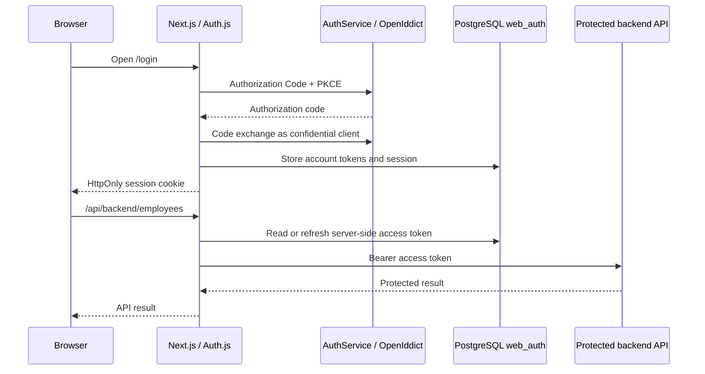

# DS frontend

The DS frontend is a Next.js application for the People & Organization workspace.

## Authentication boundary

The browser receives only Auth.js' opaque, `HttpOnly` database-session cookie. OAuth access and refresh tokens live in PostgreSQL schema `web_auth`; they are never exposed to React state, TanStack Query, Axios, local storage, or the browser session JSON.



The BFF route only proxies the explicitly allowlisted `/api/departments`, `/api/positions`, `/api/locations`, `/api/employees`, and `/api/audit` paths. It rejects cross-origin mutations and never forwards an upstream `Set-Cookie` header.

## Local setup

Use Node 20.9+; the project is verified with Node 22. The secrets policy permits `.env.example` as the public configuration contract. Do not create or commit `.env` files.

1. Create the required values interactively in a project vault, for example `ds-portfolio-dev`, with `~/.local/bin/secrets-edit ds-portfolio-dev`.
2. Supply only variable names from [.env.example](.env.example). `AUTH_SECRET`, `AUTH_OIDC_CLIENT_SECRET`, and `DATABASE_URL` are sensitive. `AUTH_OIDC_ISSUER` addresses AuthService; `BACKEND_API_ORIGIN` addresses nginx. The AuthService also needs `Auth__WebClient__Enabled`, `Auth__WebClient__FrontendOrigin`, and `Auth__WebClient__ClientSecret`.
3. Apply the idempotent database migration through the narrow migration process:

   ```bash
   ~/.local/bin/secrets-run ds-portfolio-dev -- npm run migrate:auth-db
   ```

4. Start the backend with those values injected so Docker Compose passes the web-client settings to AuthService:

   ```bash
   ~/.local/bin/secrets-run ds-portfolio-dev -- docker compose up --build
   ```

5. Start Next.js with the same narrowly injected configuration:

   ```bash
   ~/.local/bin/secrets-run ds-portfolio-dev -- npm run dev
   ```

The client is disabled until `Auth__WebClient__Enabled` is true. AuthService then seeds `portfolio-web` as a confidential OpenIddict client, with callback `/api/auth/callback/openiddict` and post-logout redirect `/login`. The pre-existing public client remains unchanged.

## Commands

```bash
npm run dev
npm run lint
npm run build
npm run migrate:auth-db
```

`npm run build` requires the server-auth environment contract because Auth.js validates routes while it builds. CI may inject safe non-production placeholders; deployments must inject real values through the secrets runner or platform secret store.

## Current verification status

Lint and a production build pass with safe build-only placeholders. AuthService builds successfully. A live browser login, refresh and logout check awaits creation of the project vault and application of `web_auth`; it is not claimed as complete.
