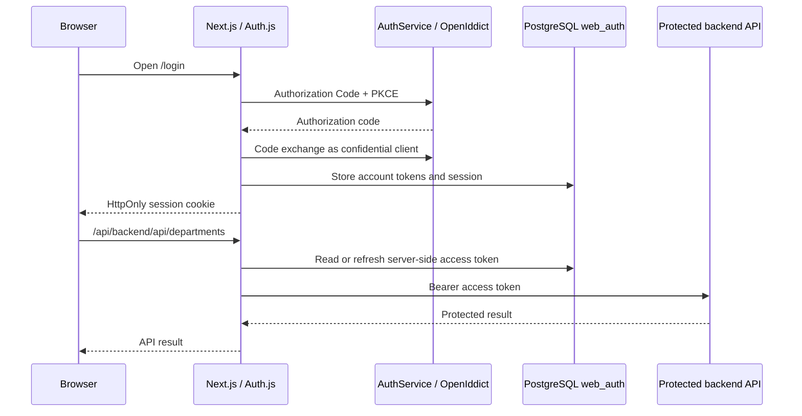

# DS frontend

The People & Organization workspace is a Next.js application for the DS platform. It provides an accessible, responsive interface for organization data while keeping OAuth credentials on the server.

## Stack

- Next.js App Router and React with TypeScript
- Auth.js with PostgreSQL-backed database sessions
- Tailwind CSS with semantic design tokens and shadcn/ui primitives
- TanStack Query for server state
- `next-themes` for persisted dark and light themes

## Architecture

```text
app/             Route composition and page metadata
entities/        Business entities and API contracts
features/        User-facing capabilities
widgets/         Composite page sections
shared/          Reusable UI, hooks, utilities, auth, and infrastructure
```

`shared/ui` is the shadcn/ui destination. Its aliases are defined in `components.json`, so newly generated components follow the same structure.

### Authentication boundary

The browser receives only Auth.js' opaque, `HttpOnly` database-session cookie. OAuth access and refresh tokens live in the PostgreSQL `web_auth` schema; they are never exposed to React state, TanStack Query, Axios, local storage, or the browser session JSON.



The BFF route proxies only explicitly allowlisted service paths and never forwards upstream cookies.

## Local setup

Use Node.js 20.9 or newer. The public configuration contract is in [.env.example](.env.example); never create or commit an `.env` file.

1. Create the required values interactively in the project vault with `~/.local/bin/secrets-edit ds-portfolio-dev`.
2. Apply the idempotent `web_auth` migration:

   ```bash
   ~/.local/bin/secrets-run ds-portfolio-dev -- npm run migrate:auth-db
   ```

3. Start the backend and frontend with the required configuration injected through the vault runner.

## Quality checks

```bash
npm run lint
npm run build
npm run migrate:auth-db
```

A full browser sign-in, refresh, and logout check requires the project vault and `web_auth` migration to be available locally.
